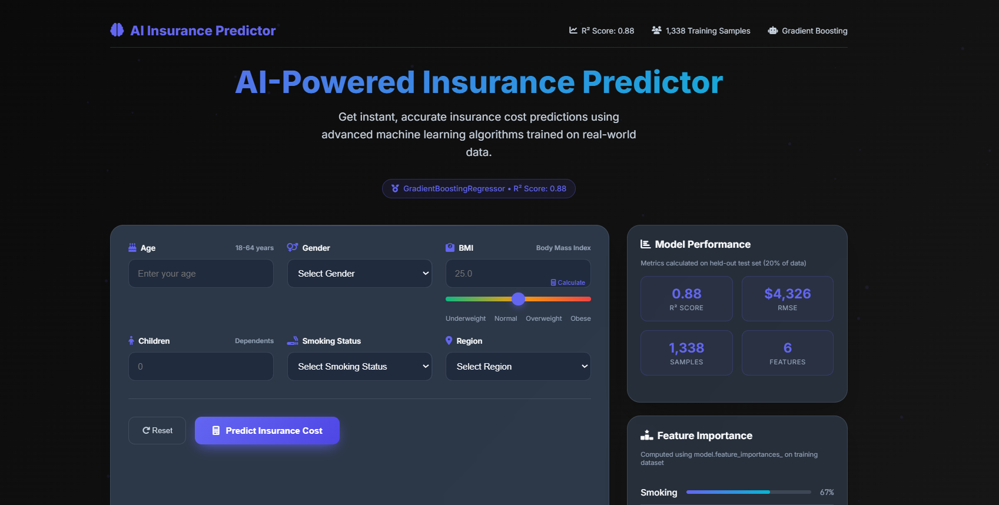

# Insurance Charges Predictor 🏥💰


A machine learning web application that predicts yearly medical insurance charges based on personal and lifestyle factors. Built with FastAPI backend and modern vanilla JavaScript frontend.

> 🌐 **[Live Demo - AWS EC2](http://52.57.67.6/)** | 📊 **R² Score: 0.88** | 🚀 **Real-time Predictions**
> 
> 🔗 **Alternative**: [Render Deployment](https://insurance-prediction-paiv.onrender.com/)

## 🌟 Features

- **Real-time Predictions**: Get instant insurance charge estimates
- **Interactive Web Interface**: Clean, responsive UI with dark theme
- **Machine Learning Model**: Gradient Boosting Regressor trained on insurance data
- **Risk Assessment**: Visual risk categorization (Low/Medium/High)
- **Profile Insights**: Dynamic analysis of key risk factors
- **GitHub Pages Deployment**: Automated deployment pipeline

## 🖼️ Screenshots

### Web Interface

*Clean, responsive UI with real-time predictions and risk assessment*

### Model Performance

*Comprehensive model evaluation with R²=0.88 and feature importance analysis*

## 🚀 Live Demo

- **🌐 AWS EC2**: [http://52.57.67.6/](http://52.57.67.6/) (Primary deployment)
- **🌐 Render**: [https://insurance-prediction-paiv.onrender.com/](https://insurance-prediction-paiv.onrender.com/) (Alternative)
- **📡 API**: Multi-platform deployment with high availability

## 📊 Model Performance

### 🏆 Algorithm: Gradient Boosting Regressor

**🎯 Key Metrics:**
- **R² Score**: 0.8795 (87.95% variance explained)
- **RMSE**: $4,325.87 (Root Mean Square Error)  
- **MAE**: $2,402.02 (Mean Absolute Error)


**Features Used:**
- **Age** (18-64 years)
- **BMI** (Body Mass Index: 15.96-53.13)
- **Children** (Number of dependents: 0-5)
- **Sex** (Male/Female)
- **Smoking Status** (Yes/No) - *Most important feature*
- **Region** (Northeast, Northwest, Southeast, Southwest)

### Feature Importance Analysis
1. **Smoking Status**: 67.65% (smoker_yes: 46.11% + smoker_no: 21.54%)
2. **BMI**: 19.07%
3. **Age**: 11.70%
4. **Children**: 1.01%
5. **Region & Sex**: <1% each

> **Key Finding**: Smokers pay ~3.2x more than non-smokers on average

## 🛠️ Tech Stack

### Backend
- **FastAPI** - Modern Python web framework
- **scikit-learn** - Machine learning library
- **pandas** - Data manipulation
- **joblib** - Model serialization
- **Uvicorn** - ASGI server

### Frontend
- **Vanilla JavaScript** - No frameworks, pure JS
- **HTML5 & CSS3** - Modern responsive design
- **Google Fonts** - Inter font family

### Deployment
- **AWS EC2** - Primary backend hosting (Free Tier)
- **GitHub Actions** - CI/CD pipeline
- **GitHub Pages** - Static site hosting
- **Render** - Alternative backend hosting

## 📁 Project Structure

```
Insurance-Prediction-/
├── app/
│   └── app/
│       ├── main.py              # FastAPI application
│       ├── model.joblib         # Trained ML model (R²=0.88)
│       ├── requirements.txt     # Python dependencies
│       ├── static/
│       │   └── app.js          # Frontend JavaScript
│       └── templates/
│           └── index.html      # Main HTML template
├── aws/
│   ├── cloudformation.yaml     # AWS CloudFormation template
│   ├── deploy.sh               # AWS deployment script
│   ├── lambda_function.py      # AWS Lambda function
│   ├── requirements.txt        # AWS Lambda dependencies
│   └── README.md               # AWS deployment guide
├── ml/
│   ├── insurance.csv           # Training dataset (1,338 records)
│   └── train_model.py          # Model training script
├── notebooks/
│   ├── model_evaluation.py     # Model metrics & visualizations
│   ├── eda_analysis.py         # Exploratory data analysis
│   └── requirements.txt        # Analysis dependencies
├── docs/
│   ├── index.html              # GitHub Pages version
│   ├── app-screenshot.png      # Application screenshot
│   ├── model_evaluation.png    # Model performance plots
│   └── static/
│       └── app.js              # Frontend for GitHub Pages
├── .github/
│   └── workflows/
│       └── deploy.yml          # GitHub Actions workflow
├── ec2-deploy.sh               # EC2 deployment automation
├── systemd-service.txt         # Systemd service configuration
├── extract_coefficients.py     # Model analysis utility
├── render.yaml                 # Render deployment config
├── requirements.txt            # Root dependencies
├── runtime.txt                 # Python version for deployment
├── DATASET.md                  # Dataset documentation
└── README.md
```

## 🏃‍♂️ Quick Start

### Prerequisites
- Python 3.8+
- pip package manager

### Local Development

1. **Clone the repository**
   ```bash
   git clone https://github.com/rohangowda2926/Insurance-Prediction-.git
   cd Insurance-Prediction-
   ```

2. **Install dependencies**
   ```bash
   cd app/app
   pip install -r requirements.txt
   ```

3. **Run the application**
   ```bash
   uvicorn main:app --reload
   ```

4. **Open your browser**
   ```
   http://localhost:8000
   ```

### Training the Model

1. **Navigate to ML directory**
   ```bash
   cd ml/
   ```

2. **Run training script**
   ```bash
   python train_model.py
   ```

### Model Evaluation & Analysis

1. **Install analysis dependencies**
   ```bash
   cd notebooks/
   pip install -r requirements.txt
   ```

2. **Run model evaluation**
   ```bash
   python model_evaluation.py
   ```

3. **Run EDA analysis**
   ```bash
   python eda_analysis.py
   ```

## 📋 API Documentation

### Endpoints

#### `GET /`
Serves the main web interface

#### `POST /predict`
Predicts insurance charges based on input features

**Request Body:**
```json
{
  "age": 30,
  "sex": "male",
  "bmi": 25.0,
  "children": 2,
  "smoker": "no",
  "region": "southeast"
}
```

**Response:**
```json
{
  "predicted_charge": 4500.25
}
```

## 🎯 Usage Examples

### Example 1: Low Risk Profile
- **Input**: Age: 25, BMI: 22, Non-smoker, 0 children, Female, Southeast
- **Predicted Charge**: ~$3,282
- **Risk Level**: Low

### Example 2: High Risk Profile  
- **Input**: Age: 55, BMI: 35, Smoker, 3 children, Male, Northwest
- **Predicted Charge**: ~$39,871
- **Risk Level**: High

### Example 3: Moderate Risk Profile
- **Input**: Age: 35, BMI: 28, Non-smoker, 2 children, Male, Northeast
- **Predicted Charge**: ~$8,547
- **Risk Level**: Moderate

## 🔧 Model Analysis & Evaluation

### Run Model Evaluation
```bash
cd notebooks/
python model_evaluation.py
```

**Generates:**
- Performance metrics (R², RMSE, MAE)
- Actual vs Predicted plots
- Residuals analysis
- Feature importance visualization

### Run EDA Analysis
```bash
cd notebooks/
python eda_analysis.py
```

**Generates:**
- Dataset statistics and insights
- Distribution plots
- Correlation analysis
- Smoker vs non-smoker analysis

### Extract Model Coefficients
```bash
python extract_coefficients.py
```

**Provides:**
- Feature importance analysis
- Sample predictions
- Client-side model coefficients

## 🚀 Deployment

### Multi-Platform Deployment

#### AWS EC2 Deployment (Primary)
The application is **deployed and live** on AWS EC2 Free Tier:

- **🌐 Live URL**: http://52.57.67.6/
- **💰 Cost**: 100% FREE for 12 months (AWS Free Tier)
- **🔧 Platform**: Ubuntu 22.04 LTS on t2.micro instance
- **🔄 Auto-Start**: Systemd service with auto-restart
- **🌐 Web Server**: Nginx reverse proxy

#### Render Deployment (Alternative)
Backup deployment on Render:

- **🌐 Live URL**: https://insurance-prediction-paiv.onrender.com/
- **⚡ Auto-Deploy**: Enabled from GitHub main branch
- **🔄 CI/CD**: Automatic builds on code changes

## 🤝 Contributing

1. Fork the repository
2. Create a feature branch (`git checkout -b feature/amazing-feature`)
3. Commit your changes (`git commit -m 'Add amazing feature'`)
4. Push to the branch (`git push origin feature/amazing-feature`)
5. Open a Pull Request

## 📝 License

This project is open source and available under the [MIT License](LICENSE).

## 🙏 Acknowledgments

- Dataset: Medical Cost Personal Datasets from Kaggle
- Icons: Emoji icons for visual elements
- Fonts: Google Fonts (Inter)

## 📞 Contact

**Rohan Dharmendra**
- GitHub: [@rohangowda2926](https://github.com/rohangowda2926)
- Project Link: [https://github.com/rohangowda2926/Insurance-Prediction-](https://github.com/rohangowda2926/Insurance-Prediction-)

---

⭐ **Star this repository if you found it helpful!**
